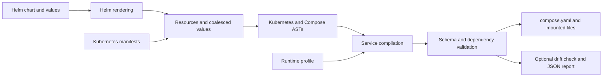

# Composer


Composer turns Helm charts and Kubernetes manifests into Docker Compose environments
for local development and single-machine deployments. It translates container
configuration, applies declarative runtime profiles, and validates the generated
Compose file. Keep your chart as the shared source of configuration, describe local
runtime choices explicitly, and check generated output for drift in CI.

**Table of contents**

- [Install](#install)
- [Quick Start](#quick-start)
- [Architecture](#architecture)
- [CI](#ci)
- [Repository map](#repository-map)
- [Development](#development)
- [Documentation](#documentation)

## Install

Requires Python 3.13+ and Poetry 2.1+. Chart rendering requires Helm 3 with the chart's
dependencies already built. Docker Compose is needed to inspect or run the output.

From a checkout of this repository:

```sh
poetry install
poetry run composer --help
```

Poetry creates the environment in `.venv/`. Compilation runs locally without a
Kubernetes cluster.

## Quick Start

Generate a starting configuration from your chart:

```sh
poetry run composer --chart ./path/to/chart --output compose.yaml
```

For an application runtime, use a [profile](docs/profiles.md) to select services,
publish ports, configure local builds and map operator-managed resources to standalone
containers:

```sh
poetry run composer --chart ./path/to/chart \
  --profile compose.profile.yaml --output compose.yaml
docker compose -f compose.yaml config
```

The [usage guide](docs/usage.md) includes a profile example, values overrides,
already-rendered manifests and the complete CLI reference. Review the generated
configuration before starting it with Docker Compose. Kubernetes controllers,
scheduling and autoscaling require explicit runtime choices; their behavior is not
reproduced by translating containers.

## Architecture

[Native GitOps ordering](docs/gitops-ordering.md) translates Argo CD phases and sync
waves, Application ownership, and Flux Kustomization/HelmRelease dependencies into
Compose startup gates.



Profiles select a resource and container, inherit its configuration, then apply local
overrides. Bindings can read rendered resource fields, container fields or Helm values.
Validation catches missing or ambiguous selections, invalid configuration and broken
startup dependencies. Source charts remain unchanged during compilation.

See [runtime profiles](docs/profiles.md) for selection and override rules, and
[compiler internals](docs/development.md#compilation-pipeline) for implementation details.

## CI

[Get a Docker Compose file for free with the GitHub Action](docs/github-action.md).
The reusable Action watches `helm/` by default and commits changed Compose output back
to your branch. Its watch directory is configurable, and it also supports drift checks.

After installing Composer and preparing your chart dependencies, check that committed
Compose output still agrees with its chart and profile:

```sh
poetry run composer --chart ./path/to/chart \
  --profile compose.profile.yaml --output compose.yaml --check
```

`--check` leaves files untouched and exits with `1` for drift or `2` for invalid input.
A matching configuration returns `0`. Use `--compare` to check an independent reference
and `--report` to save compilation provenance; see [comparison and reports](docs/usage.md#comparison-and-reports).

The reusable [`helm-composer` pre-commit hook](.pre-commit-hooks.yaml) regenerates
Compose when chart inputs change. See [hook setup](docs/usage.md#pre-commit) for
configuration and handling generated changes.

This repository's [CircleCI workflow](.circleci/config.yml) runs linting, strict typing,
docstring validation and compiler tests with real Helm fixtures.

## Repository map

| Location                                           | Responsibility                                          |
| -------------------------------------------------- | ------------------------------------------------------- |
| [`pkg/composer/`](pkg/composer/)                   | CLI, profile resolution and compilation.                |
| [`pkg/composer/ast/`](pkg/composer/ast/)           | Kubernetes and Compose models and conversion utilities. |
| [`pkg/composer/schemas/`](pkg/composer/schemas/)   | Bundled runtime profile and Compose JSON Schemas.       |
| [`tests/`](tests/)                                 | Compiler unit tests and real Helm rendering tests.      |
| [`.circleci/config.yml`](.circleci/config.yml)     | Portable compiler verification workflow.                |
| [`.pre-commit-hooks.yaml`](.pre-commit-hooks.yaml) | Reusable Compose generation hook.                       |
| [`docs/`](docs/)                                   | Usage, profile reference and contributor documentation. |

## Development

```sh
poetry run python -m unittest discover -s tests
```

See [development](docs/development.md) for the full checks, pre-commit setup, package
builds, compiler internals and optional application integration tests.

## Documentation

- [Usage and CLI reference](docs/usage.md)
- [Runtime profiles](docs/profiles.md)
- [Development and integration checks](docs/development.md)
